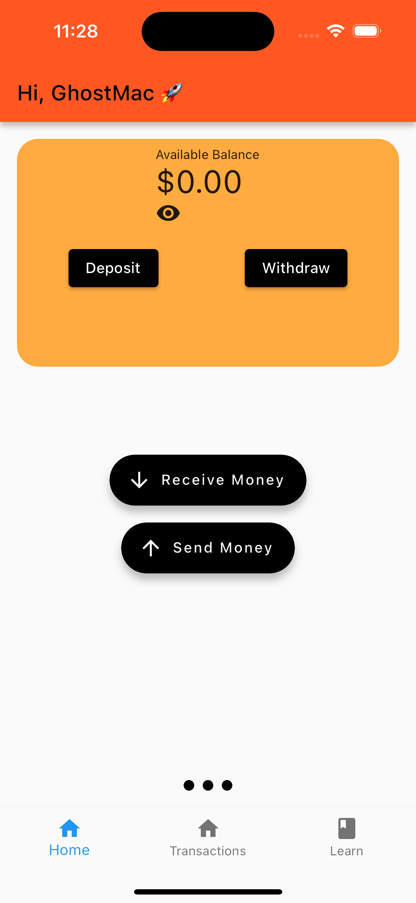

# flyio

## Feature
The current state of the app looks like: 

## TODO
- [ ] Refactor the `floatingNavigationButtons`
- [ ] Add screens and for Transactions and Learn
- [ ] Probably change Learn to something else
- [ ] Add animator for the two `floatingNavigationButtons`
- [ ] Fix `currentPage` `CircleIndicator` class